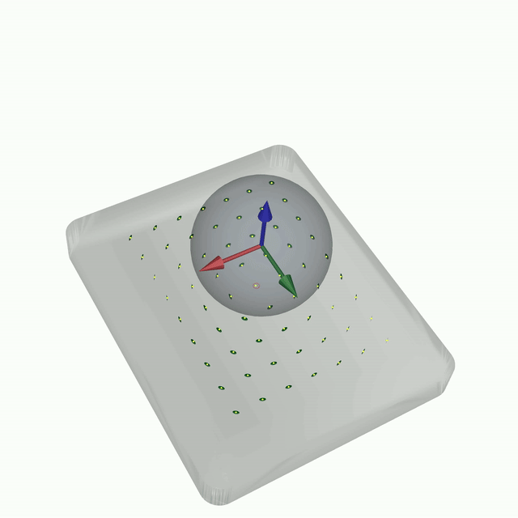
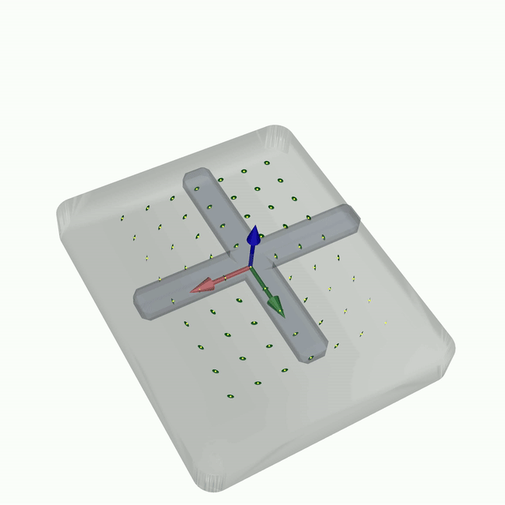
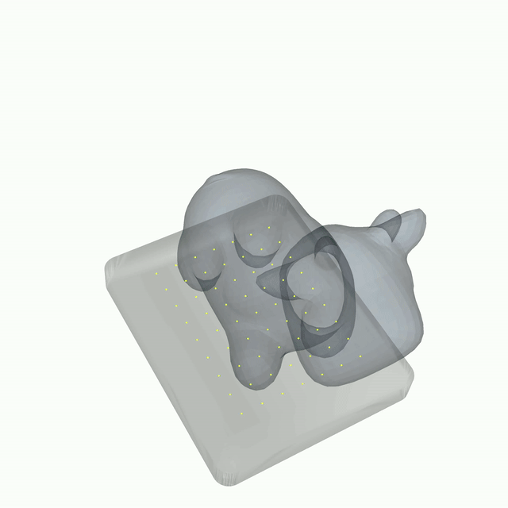
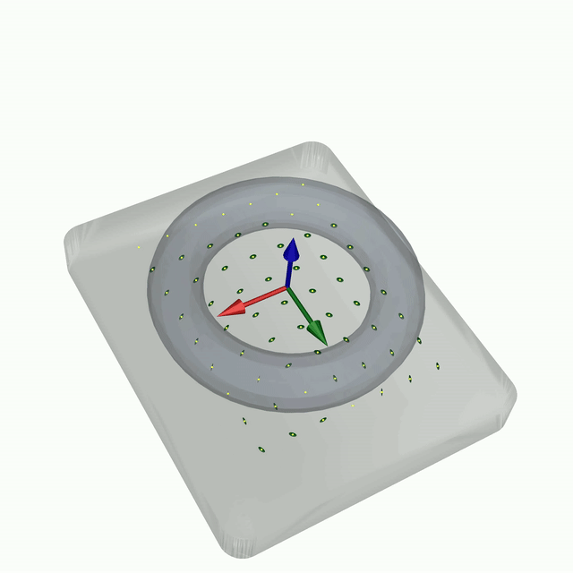
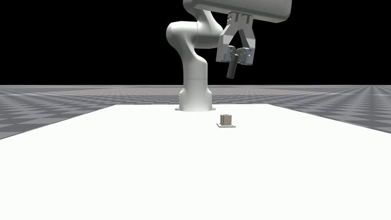
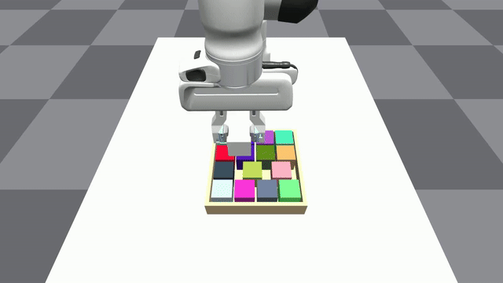
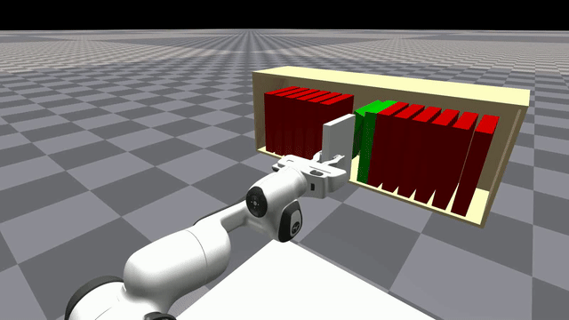
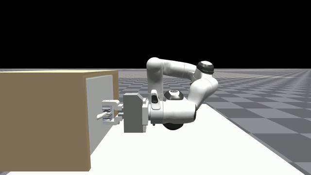

<h1 align="center"> 🏄 HydroShear: Hydroelastic Shear Simulation for Tactile Sim-to-Real Reinforcement Learning </h1>

<div align="center">

[[arXiv]](https://arxiv.org/abs/2603.00446)
[[Website]](https://hydroshear.github.io/)
[[X (Twitter)]](https://x.com/jayjunleee/status/2028978843332297103)


</div>

HydroShear is a tactile shear simulator that enables sim-to-real transfer of tactile policies from simulation to the real world.

This repository contains code to visualize HydroShear and train tactile policies
for manipulation tasks such as peg insertion, bin packing, book shelving, and drawer pulling.

## Table of Contents

- [⚙️ Installation](#installation)
- [🚀 Quickstart](#quickstart)
- [🎥 Demo](#demo)
- [🏋️ Training](#training)
  - [Stage 1: Teacher Training](#stage-1-teacher-training-without-contact-penalty)
  - [Stage 2: Teacher Training](#stage-2-teacher-training-with-contact-penalty)
  - [Stage 3: Student Training](#stage-3-student-training-with-aacd)
- [🎮 Play](#play)
- [📄 License](#license)
- [🙏 Acknowledgements](#acknowledgements)
- [📖 Citation](#citation)


## Installation 

**NOTE**: Have conda installed and set up in your terminal.

On the root of the repository, run the following:
```bash
source setup_env.sh
```

If you want to just run the demo code run the following:
```bash
source setup_env_noisaac.sh
```

## Quickstart

To run the vedo demo, run this command
```bash
python scripts/demo/demo_vedo.py
```

### 3. Run pretrained peg insertion policy

To play a pretrained hydroshear peg insertion policy, run the following:

```bash
gdown https://drive.google.com/uc?id=1ewYvSpdXAhnkq3Ig8Ops4j59uqDzfNVk
unzip quickstart_ckpt.zip

# the play command for student policy (with no tactile visual)
python scripts/experiments/hydroshear/play_hydroshear.py   --ckpt_path quickstart_ckpt/peg_insertion_student_hydroshear/nn/best_sr_0.94.pth

# the play command for student policy (with tactile visual)
python scripts/experiments/hydroshear/play_hydroshear.py   --ckpt_path quickstart_ckpt/peg_insertion_student_hydroshear/nn/best_sr_0.94.pth --debug-vis

# the play command for teacher policy (with no tactile visual)
python scripts/experiments/hydroshear/play_hydroshear.py   --ckpt_path quickstart_ckpt/peg_insertion_teacher/nn/best_sr_0.97.pth

# the play command for teacher policy (with tactile visual)
python scripts/experiments/hydroshear/play_hydroshear.py   --ckpt_path quickstart_ckpt/peg_insertion_teacher/nn/best_sr_0.97.pth --use-hydrosoft-model --add-touch-obs --debug-vis
```

## Demo

<div align="center">

<table>
<tr>
<td align="center">
<b>Sphere</b><br>

</td>

<td align="center">
<b>Cross</b><br>

</td>
</tr>

<tr>
<td align="center">
<b>Cow</b><br>

</td>

<td align="center">
<b>Torus (Ring)</b><br>

</td>
</tr>
</table>

</div>

You can run the hydroshear demo by running one of the following:

```bash
# for vedo visual
python scripts/demo/demo_vedo.py

# for vedo visual using complex geometry
python scripts/demo/demo_vedo_complex.py

# for viser visual
python scripts/demo/demo_viser.py
```

To change the object being used in `demo_vedo_complex.py`, refer to the following lines inside the file (line 18-23):
```python
# OBJECT_PATH = "demo_assets/sphere.obj"
# OBJECT_PATH = "demo_assets/small_cow.stl"
OBJECT_PATH = "demo_assets/torus_7mm.stl"
# OBJECT_PATH = "demo_assets/dumbbell_09x.stl"
# OBJECT_PATH = "demo_assets/cross2_09x.stl"
# OBJECT_PATH = "demo_assets/star_small.stl"
```

Refer to [vedo_controls.md](vedo_controls.md) on how to use the vedo scripts once running.

## Training

We provide the following commands to quickly train a tactile policy for `Peg Insertion`. Please take a look at [training.md](training.md) for details on how to train on `Bin Packing`, `Book Shelving`, and `Drawer Pulling` tasks.

### Stage 1: Teacher training without contact penalty
```bash
python scripts/experiments/hydroshear/train_teacher.py train=hydroshear/peg_insertion/teacher_lstm task=TacSLTaskInsertion wandb_name=peg_insertion_teacher_stage_1 rl.contact_penalty_scale=0.0 wandb_activate=True
```

### Stage 2: Teacher training with contact penalty
```bash
python scripts/experiments/hydroshear/train_teacher.py train=hydroshear/peg_insertion/teacher_lstm task=TacSLTaskInsertion wandb_name=peg_insertion_teacher_stage_2 wandb_activate=True ckpt=/path/to/ckpt_stage1.pt
```

### Stage 3: Student training with AACD
```bash
# HydroShear student
python scripts/experiments/hydroshear/train_student_aacd.py train=hydroshear/peg_insertion/student_lstm task=TacSLTaskInsertion wandb_name=peg_insertion_student_hydroshear wandb_activate=True task.env.use_hydrosoft_model=True ckpt=/path/to/ckpt_stage2.pt
```

## Play

<div align="center">

<table>
<tr>
<td align="center">
<b>Peg Insertion</b><br>

</td>

<td align="center">
<b>Bin Packing</b><br>

</td>
</tr>

<tr>
<td align="center">
<b>Book Shelving</b><br>

</td>

<td align="center">
<b>Drawer Pulling</b><br>

</td>
</tr>
</table>

</div>

To play a trained policy, run the following command:

```bash
python scripts/experiments/play_hydroshear.py --ckpt-path $ckpt_path
```

`play_hydroshear.py` contains a long list of flags that can be used for visualization. Below are the most relevant flags:

| Flag           | Type   | Description                                | Default  |
| -------------- | ------ | ------------------------------------------ | -------- |
| `--ckpt-path`    | string | Path to the checkpoint to load             | required |
| `--headless`     | bool   | Prevents rendering playing                 | `False`  |
| `--debug_vis`    | bool   | Enable debugging visualization             | `False`  |

**NOTE**: If you are using a teacher checkpoint and would like to use `debug_vis` to see what the tactile model output would look like, use these flags in addition to setting `debug_vis` to `True`:

| Flag           | Type   | Description                                | Default  |
| -------------- | ------ | ------------------------------------------ | -------- |
| `--add-touch-obs`        | bool | Must be `True` to use flags below.     | `False` |
| `--add-tactile-rgb-obs`  | bool | Enables tacsl grayscale                | `False` |
| `--use-hydrosoft-model`  | bool | Enables HydroShear                     | `False` |
| `--use-tacsl-model`      | bool | Enables tacsl shear                    | `False` |
| `--use-fots-model`       | bool | Enables fots shear                     | `False` |

### Example

If you wanted to run the play a teacher policy and add the tacsl shear visualization to see what the tacsl shear output would look like, run the following command:

```bash
python scripts/experiments/play_hydroshear.py \
  ckpt_path=/path/to/student.pt \
  --add-touch-obs --use-tacsl-model --debug-vis
```

## License

This repository is under the [MIT License](LICENSE).  

## Acknowledgements

This code was adapted and/or inspired by:
- [RL Games](https://github.com/Denys88/rl_games)
- [Penspin](https://github.com/HaozhiQi/penspin)
- [IsaacGymEnvs](https://github.com/isaac-sim/IsaacGymEnvs)

We would like to thank Amazon Industrial Robotics (AIR) for supporting our work.

## Citation

```bibtex
@misc{danglee2026hydroshear,
      title={HydroShear: Hydroelastic Shear Simulation for Tactile Sim-to-Real Reinforcement Learning}, 
      author={An Dang and Jayjun Lee and Mustafa Mukadam and X. Alice Wu and Bernadette Bucher and Manikantan Nambi and Nima Fazeli},
      year={2026},
      eprint={2603.00446},
      archivePrefix={arXiv},
      primaryClass={cs.RO},
      url={https://arxiv.org/abs/2603.00446}, 
}
```